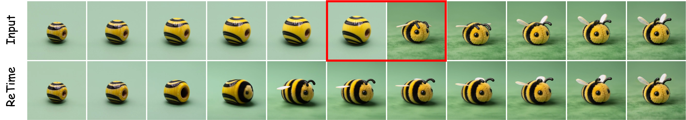

# Video Analysis and Generation via a Semantic Progress Function



<p align="center">
  <a href="https://sagipolaczek.github.io/semantic-progress-function/"></a>
  <a href="https://arxiv.org/abs/2604.22554"></a>
  <a href="https://huggingface.co/papers/2604.22554"></a>
  <a href="#"></a>
</p>

[**Gal Metzer**](https://galmetzer.github.io/)\* &nbsp;&nbsp; [**Sagi Polaczek**](https://sagipolaczek.github.io/)\* &nbsp;&nbsp; [**Ali Mahdavi-Amiri**](https://arash-mham.github.io/) &nbsp;&nbsp; [**Raja Giryes**](https://www.giryes.sites.tau.ac.il/) &nbsp;&nbsp; [**Daniel Cohen-Or**](https://danielcohenor.com/)


> Transformations produced by image and video generation models often evolve in a highly non-linear manner: long stretches where the content barely changes are followed by sudden, abrupt semantic jumps. To analyze and correct this behavior, we introduce a Semantic Progress Function, a one-dimensional representation that captures how the meaning of a given sequence evolves over time. For each frame, we compute distances between semantic embeddings and fit a smooth curve that reflects the cumulative semantic shift across the sequence. Departures of this curve from a straight line reveal uneven semantic pacing. Building on this insight, we propose a semantic linearization procedure that reparameterizes (or retimes) the sequence so that semantic change unfolds at a constant rate, yielding smoother and more coherent transitions.Beyond linearization, our framework provides a model-agnostic foundation for identifying temporal irregularities, comparing semantic pacing across different generators, and steering both generated and real-world video sequences toward arbitrary target pacing.


## Walkthrough

End-to-end explanation, including examples.

<p align="center">
  <video src="https://github.com/user-attachments/assets/ca089831-d50e-4064-8e91-601b02e77905" controls="controls" muted="muted" style="max-width: 960px; width: 100%;">
  </video>
</p>


## Installation

```bash
git clone https://github.com/SagiPolaczek/semantic-progress-function.git
cd semantic-progress-function
pip install -e .
```

## Python API

```python
from spf import SigLIPEmbedder, SolveDirect, invert_potential
from pathlib import Path

# 1. Embed video frames
embedder = SigLIPEmbedder()
embeddings = embedder.embed_video(Path("your_video.mp4"))

# 2. Compute SPF
solver = SolveDirect()  # paper defaults: k=30, sigma=20, lmd=1e-5
potential = solver(embeddings)

# 3. Invert for temporal re-parameterisation
warped_positions = invert_potential(potential, num_frames=81)
```

### Segmentation

```python
from spf import LineSegmentor

seg = LineSegmentor().fit_k(potential, k=4)  # exactly 4 segments
for start, end, slope, intercept in seg.get_coefficients():
    print(f"  Frames {start}-{end}: slope={slope:.4f}")
```

### Visualisation

```python
from spf import plot_potential, plot_spf_report

plot_potential(potential, save_path="spf_curve.png")
plot_spf_report(potential, seg, frames=frames, save_path="report.png")
```

## ComfyUI Integration

The included workflow (`comfyui/retime_workflow.json`) runs the full two-pass ReTime pipeline inside ComfyUI.

### Setup

**1. Install the SPF package** (in your ComfyUI Python environment)

```bash
cd /path/to/SPF
pip install -e .
```

**2. Symlink the custom nodes into ComfyUI**

```bash
ln -s /path/to/SPF/comfyui/nodes \
      /path/to/ComfyUI/custom_nodes/SPF-ReTime
```

**3. Install community nodes**

The workflow uses `easy int` from [ComfyUI-Easy-Use](https://github.com/yolain/ComfyUI-Easy-Use) and `ImageConcatMulti` from [ComfyUI-KJNodes](https://github.com/kijai/ComfyUI-KJNodes):

```bash
cd /path/to/ComfyUI/custom_nodes
git clone https://github.com/yolain/ComfyUI-Easy-Use.git
git clone https://github.com/kijai/ComfyUI-KJNodes.git
```

**4. Load the workflow**

Start ComfyUI and drag `comfyui/retime_workflow.json` into the UI.

## ✍🏼 Citation
If you find this code useful for your research, please consider citing us:

```
@article{metzer2026video,
  title={Video Analysis and Generation via a Semantic Progress Function},
  author={Metzer, Gal and Polaczek, Sagi and Mahdavi-Amiri, Ali and Giryes, Raja and Cohen-Or, Daniel},
  journal={arXiv preprint arXiv:2604.22554},
  year={2026}
}
```
